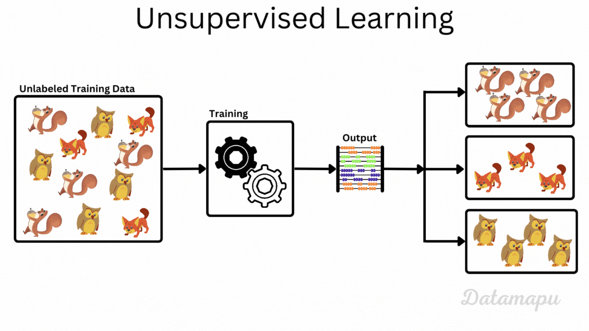
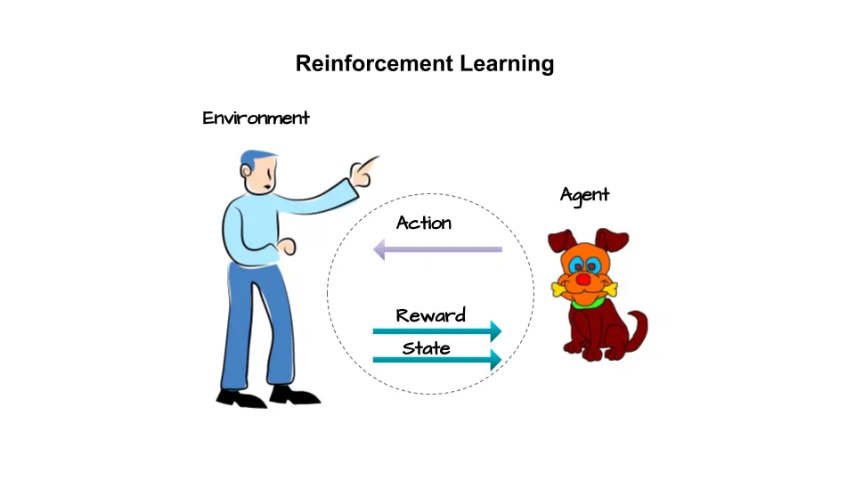

# Machine Learning

🌟 What is Machine Learning?
    Imagine you're teaching a small robot.

    Normal programming is like this:
        You give the robot step-by-step rules to follow.

    Machine Learning (ML) is different:
        Instead of giving rules, you give examples, and the robot learns the rules by itself!

🧠 Simple Example:
    
    You want to teach a robot to tell the difference between cats and dogs.

    In Machine Learning, you:

        📸 Give it lots of pictures of cats and dogs.

        🏷️ Each picture has a label like: "This is a cat" or "This is a dog".

        🤖 The robot (ML model) looks at many examples and learns patterns.

        📷 Later, you show a new picture, and the robot guesses:
            "Hmm... I think this is a cat!"

🔍 Real Life Examples of Machine Learning:

    YouTube recommending videos 🎥

    Google Maps predicting traffic 🚗

    Amazon suggesting products 🛒

    Siri or Alexa understanding your voice 🗣️

    Self-driving cars learning how to drive 🚘

🤓 Big Idea:

    Machine Learning is when computers learn from data instead of being told what to do.

## Types of Machine Learning

1. **Supervised Learning**:
    - The computer learns from labeled data.
    - Example: Classifying emails as spam or not.
    - Algorithms: Decision Trees, Neural Networks, Support Vector Machines (SVMs).

2. **Unsupervised Learning**:
    - The computer learns from unlabeled data.
    - Example: Grouping customers into segments based on their behavior.
    - Algorithms: K-means clustering, Principal Component Analysis (PCA).

3. **Reinforcement Learning**:
    - The computer learns by interacting
    with an environment.
    - Example: Training a robot to walk.
    - Algorithms: Q-learning, Policy Gradients.

🤖 Machine Learning in Everyday Life:
    - Netflix suggests movies
    - Spotify recommends songs
    - Your phone understands your voice
    - Your phone suggests apps
    - Your phone suggests contacts
    - Your phone suggests places
    

    

# Supervised Learning

## Without using tech words.

🧸 Imagine This:

    You're a little kid and you're learning about fruits 🍎🍌🍊.

    Your teacher (the computer programmer) shows you some pictures of fruits, and tells you the names:

        Shows a picture of a red round fruit → says "This is an apple."

        Shows a picture of a long yellow fruit → says "This is a banana."

        Shows a picture of a small orange ball → says "This is an orange."

    Now you see lots of fruit pictures with the answers. You keep watching and learning.

🍎 Now the Magic:

    One day, your teacher shows you a new picture and says:

        "Can you tell me what fruit this is?"

        You've seen so many before, you say:

            "That looks like a banana!"

    🎉 You just used supervised learning.

🧠 What Really Happened?

    You saw examples with answers.

    You learned what each fruit looks like.

    You used that learning to guess new fruits correctly.

📚 In Computer Terms:

    The pictures = input

    The names (apple, banana...) = labels

    The process of learning = training

    The guessing part = prediction

🔁 Supervised Learning = Learn with Answers

Just like:

    A student learns from a teacher who gives questions and answers.

    A computer learns from data where we already know the correct answers.

👶 Summary for a Beginner:

    Supervised learning is when a computer learns by looking at examples that already have answers. Then it tries to guess the answer for new examples.

🧠 What is Supervised Learning?

    Supervised Learning is a type of machine learning where we train a model on a labeled dataset, meaning each training example has an input and a known correct output (label).

    The model learns a mapping from inputs to outputs so it can predict the output for new, unseen data.

🔧 Key Terms Explained:

| Term              | Meaning                                                                        |
| ----------------- | ------------------------------------------------------------------------------ |
| **Input (X)**     | The data we give to the model to learn from (e.g., features like age, salary). |
| **Output (Y)**    | The correct answer/label for each input (e.g., "buys product" = 1).            |
| **Model**         | A mathematical function that learns the relationship between X and Y.          |
| **Training**      | The process of teaching the model by feeding it many (X, Y) pairs.             |
| **Prediction**    | The output the model gives when we give it new input data.                     |
| **Loss Function** | Measures how far the model’s predictions are from the actual values.           |
| **Optimization**  | The process of improving the model to reduce the error/loss.                   |

🧭 Two Main Types of Supervised Learning

| Type               | Description                       | Example                             |
| ------------------ | --------------------------------- | ----------------------------------- |
| **Classification** | Output is a **category/class**    | Spam detection, disease prediction  |
| **Regression**     | Output is a **continuous number** | House price prediction, stock price |

🔁 Supervised Learning Workflow

1. Collect labeled data:
    e.g., Data like:
        | Age | Salary | Buys Product (Y) |
        | --- | ------ | ---------------- |
        | 25  | 50k    | Yes              |
        | 40  | 80k    | No               |
        | 30  | 60k    | Yes              |
        | ... | ...    | ...              |

2. Split into training and test sets:

    Training set → used to train the model

    Test set → used to evaluate the model’s accuracy

3. Choose a model:
    
    Examples: Linear Regression, Decision Tree, SVM, KNN

4. Train the model:
    
    Use the training set to adjust internal parameters.

5. Evaluate the model:

    Check how well the model works on new, unseen data using metrics like accuracy or RMSE.

6. Make predictions on new data.

🔍 Common Algorithms Used in Supervised Learning:

| Algorithm              | Task Type      |
| ---------------------- | -------------- |
| Linear Regression      | Regression     |
| Logistic Regression    | Classification |
| Decision Trees         | Both           |
| Random Forest          | Both           |
| Support Vector Machine | Both           |
| K-Nearest Neighbors    | Both           |
| Neural Networks        | Both           |

[Source](https://medium.com/@gerzson.boros/a-simple-introduction-into-supervised-learning-dcce83ee3ada)

# Unsupervised Learning

## Without using tech words.

🧸 Imagine This:

    You go to a toy store. 🎁

    You find a big basket of toys — but...

        ❌ There are no names on them

        ❌ Nobody tells you what toy is what

        🤔 You just look at them and say:

            "Hey! These look similar. I think they belong together!"

            So you group them like this:

            | Group | What you see                    |
            | ----- | ------------------------------- |
            | 🧺 1  | All soft, fluffy animals 🐻🐶🐱 |
            | 🧺 2  | All cars 🚗🚕🚙                 |
            | 🧺 3  | All toy fruits 🍎🍌🍇           |

        You didn’t know their names.

        You just used your eyes to group them.

        That’s Unsupervised Learning! 🎉

        The computer does the same thing!

🖥️ What Does the Computer See?

    Let’s say you give the computer some pictures.

        You don’t tell it what they are. ❌

        You just say:  “Here are 100 pictures.

        You figure out which ones are similar.”

    The computer looks at shapes, colors, size… and says:

        Group 1: all round red things 🍎🍒

        Group 2: all yellow long things 🍌

        Group 3: all green bumpy ones 🥒

        💡 Even though it doesn’t know the names like “apple” or “banana”, it still finds groups!

🎲 Let’s Do a Kid-Level Example with Shapes

    Step-by-Step:
        
        You have a box of toy blocks:

            🔵 Blue Circles

            🔺 Red Triangles

            🟩 Green Squares

            You tell the computer: “Here are the blocks”

            ❌ But you don’t tell the names like “circle” or “triangle”

        The computer looks and thinks:

            "These round ones go together" 🔵🔵🔵

            "These pointy ones go together" 🔺🔺🔺

            "These square ones go together" 🟩🟩🟩

    🎉 Boom! That’s Unsupervised Learning!

💬 How Is It Different from Supervised Learning?

    | Supervised (👨‍🏫 Teacher) | Unsupervised (🧩 No Teacher) |
    | -------------------------- | ---------------------------- |
    | You give the answers ✔️    | You don’t give answers ❌     |
    | “This is a cat” 🐱         | “Here are animals” 🐱🐶🐘    |
    | It learns from examples    | It finds patterns by itself  |

🧠 So Why Use It?

    Sometimes:

        We don’t know the answers

        Or there are too many to label

        Or we want the computer to explore by itself!

🛍️ Real-World Simple Examples:

    1. Grocery Store

        The store wants to group customers:

            One group buys candy 🍬

            Another buys vegetables 🥦

            Another buys baby food 🍼

        Computer groups them into “customer types” — without knowing their names!

    2. Photo Album

        You give your computer 1,000 photos 😮

            It groups them:

                “These have your dog” 🐶

                “These have your friends” 👯

                “These are outdoors” 🏞️

            No names needed — just group by looks!
    

🧪 Names of the Tools (just for fun):

| Name        | Like…                                  |
| ----------- | -------------------------------------- |
| **K-Means** | Grouping by counting similar toys 🧮   |
| **PCA**     | Shrinking big mess into simple view 🔍 |
| **DBSCAN**  | Grouping by closeness 📏               |

[Source](https://datamapu.com/posts/ml_concepts/supervised_unsupervised/)

# Reinforcement Learning

🤖 What is Reinforcement Learning?

    Think of a little robot learning something by trying.

        Nobody tells the robot exactly what to do.

        It tries things, makes mistakes, and learns from them!

        If it does something good ✅ — it gets a reward (like points 🎯).

        If it does something bad ❌ — it gets a punishment (like losing points ☠️).

        Just like a kid learning how to ride a bicycle 🚲

🧸 Real-Life Analogy:

    Imagine you are playing a video game for the first time:

        First, you don’t know the rules.

        You press buttons randomly 🎮.

        If you jump over a monster and survive ➡️ you get points ✅.

        If you fall into a hole ➡️ you lose a life ❌.

        🎉 After playing again and again, you learn: “Aha! I should jump over the monster and not go near the hole.”

    That’s exactly how Reinforcement Learning works.

🎲 Let’s See a Super Simple Story

    Story: Robot Learns to Walk

           You have a cute robot named Robo 🤖

           You want it to walk without falling.

           You say: "Try walking!"

           Robo moves forward ➡️

            If it takes a step and doesn’t fall: 🏆 +1 reward

            If it falls down: ❌ -1 punishment

            Robo tries 100 times.

            At first, it keeps falling 😢

            But after many tries, it figures out how to walk 👣🎉

🎯 Important Words to Remember:

    | Word            | Meaning (like a kid)                     |
    | --------------- | ---------------------------------------- |
    | **Agent**       | The learner (like Robo the robot) 🤖     |
    | **Environment** | The world Robo is in (the room) 🌍       |
    | **Action**      | What Robo does (walk, turn, jump) 🔁     |
    | **Reward**      | Good points (+1 for walking) 🏆          |
    | **Punishment**  | Bad points (-1 for falling) ❌            |
    | **Goal**        | What Robo wants (like reach the door 🚪) |

🚗 Real-Life Examples

    Self-driving cars 🚘

        Try to drive without crashing

        Reward for safe driving, penalty for accidents

    
    Video Game AI 🎮

        Learns to beat levels like a pro gamer

        Reward for winning, penalty for losing

    Robots 🤖

        Learn to walk, pick things, or even cook!

    Chatbots 🗣️

        Learn better replies by trying different answers and getting feedback.

💡 How is it Different?

    | Supervised            | Unsupervised             | Reinforcement               |
    | --------------------- | ------------------------ | --------------------------- |
    | Has correct answers ✅ | No answers ❌             | Learns by rewards 🏆        |
    | "This is a cat" 🐱    | "Find similar things" 🔍 | "Try and learn from it!" 🎮 |

🧰 Popular Tools / Algorithms in Reinforcement Learning

    These are like different learning styles for our robot friend 🤖

    | Name                | Like...                                            | What It Does (Easy Words)                                          |
    | ------------------- | -------------------------------------------------- | ------------------------------------------------------------------ |
    | **Q-Learning**      | A robot writing a "cheat sheet" 📝                 | Remembers which actions give the best rewards in each situation ✅❌ |
    | **SARSA**           | A robot learning from what *actually* happens 📒   | Learns step-by-step from real moves and results 🪜                 |
    | **Deep Q-Learning** | A robot using a **brain made of math** 🧠          | Uses a **neural network** to make smart guesses about what to do   |
    | **Policy Gradient** | A robot trying many ways until it finds best 🎯    | Learns directly how to act, like learning dance steps 💃           |
    | **Actor-Critic**    | A team: one robot acts, the other gives advice 🗣️ | One part chooses action, other tells if it was good or bad 👍👎    |

    🎉 Simple Story to Remember Them

        Let’s pretend your robot is learning how to find a treasure chest 🏆

            🧠 Q-Learning:
                Robo writes down every step and the score it gets, then uses it later.

            ✍️ SARSA:
                Robo updates its notebook while walking, based on what actually happens.

            🌈 Deep Q-Learning:
                Robo uses a clever brain (neural network) to guess what’s best — even in tricky worlds!

            💃 Policy Gradient:
                Robo doesn’t write scores — it tries many ways to reach treasure and keeps what works best.

            🧑‍🤝‍🧑 Actor-Critic:
                Robo has a buddy team:

                Actor: “I’ll try this move!”

                Critic: “That was smart!” or “Oops, bad idea!”

[Source](https://medium.com/geekculture/introduction-to-deep-reinforcement-learning-268ebd44b23)

