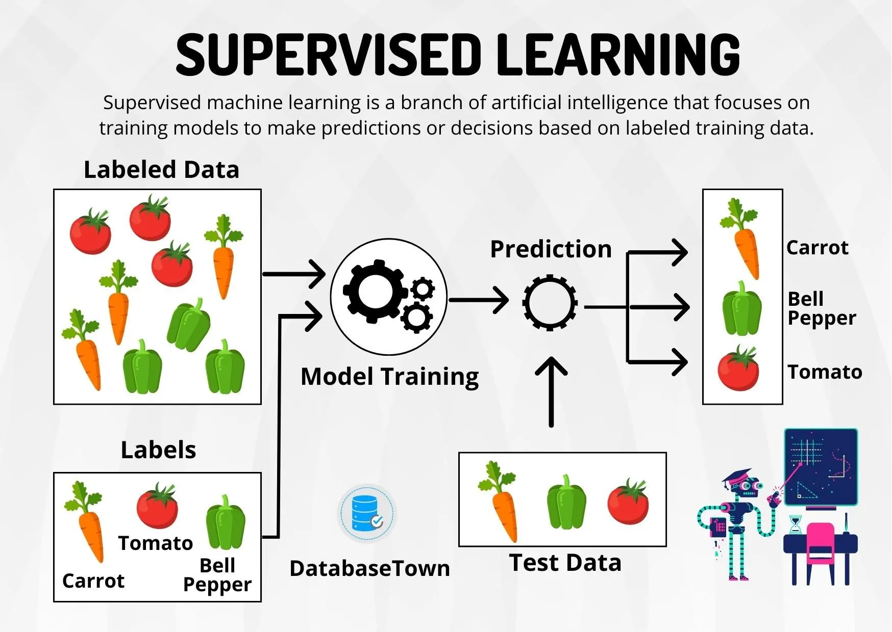

# Supervised Learning

## Without using tech words.

🧸 Imagine This:

    You're a little kid and you're learning about fruits 🍎🍌🍊.

    Your teacher (the computer programmer) shows you some pictures of fruits, and tells you the names:

        Shows a picture of a red round fruit → says "This is an apple."

        Shows a picture of a long yellow fruit → says "This is a banana."

        Shows a picture of a small orange ball → says "This is an orange."

    Now you see lots of fruit pictures with the answers. You keep watching and learning.

🍎 Now the Magic:

    One day, your teacher shows you a new picture and says:

        "Can you tell me what fruit this is?"

        You've seen so many before, you say:

            "That looks like a banana!"

    🎉 You just used supervised learning.

🧠 What Really Happened?

    You saw examples with answers.

    You learned what each fruit looks like.

    You used that learning to guess new fruits correctly.

📚 In Computer Terms:

    The pictures = input

    The names (apple, banana...) = labels

    The process of learning = training

    The guessing part = prediction

🔁 Supervised Learning = Learn with Answers

Just like:

    A student learns from a teacher who gives questions and answers.

    A computer learns from data where we already know the correct answers.

👶 Summary for a Beginner:

    Supervised learning is when a computer learns by looking at examples that already have answers. Then it tries to guess the answer for new examples.

🧠 What is Supervised Learning?

    Supervised Learning is a type of machine learning where we train a model on a labeled dataset, meaning each training example has an input and a known correct output (label).

    The model learns a mapping from inputs to outputs so it can predict the output for new, unseen data.

🔧 Key Terms Explained:

| Term              | Meaning                                                                        |
| ----------------- | ------------------------------------------------------------------------------ |
| **Input (X)**     | The data we give to the model to learn from (e.g., features like age, salary). |
| **Output (Y)**    | The correct answer/label for each input (e.g., "buys product" = 1).            |
| **Model**         | A mathematical function that learns the relationship between X and Y.          |
| **Training**      | The process of teaching the model by feeding it many (X, Y) pairs.             |
| **Prediction**    | The output the model gives when we give it new input data.                     |
| **Loss Function** | Measures how far the model’s predictions are from the actual values.           |
| **Optimization**  | The process of improving the model to reduce the error/loss.                   |

🧭 Two Main Types of Supervised Learning

| Type               | Description                       | Example                             |
| ------------------ | --------------------------------- | ----------------------------------- |
| **Classification** | Output is a **category/class**    | Spam detection, disease prediction  |
| **Regression**     | Output is a **continuous number** | House price prediction, stock price |

🔁 Supervised Learning Workflow

1. Collect labeled data:
    e.g., Data like:
        | Age | Salary | Buys Product (Y) |
        | --- | ------ | ---------------- |
        | 25  | 50k    | Yes              |
        | 40  | 80k    | No               |
        | 30  | 60k    | Yes              |
        | ... | ...    | ...              |

2. Split into training and test sets:

    Training set → used to train the model

    Test set → used to evaluate the model’s accuracy

3. Choose a model:
    
    Examples: Linear Regression, Decision Tree, SVM, KNN

4. Train the model:
    
    Use the training set to adjust internal parameters.

5. Evaluate the model:

    Check how well the model works on new, unseen data using metrics like accuracy or RMSE.

6. Make predictions on new data.

🔍 Common Algorithms Used in Supervised Learning:

| Algorithm              | Task Type      |
| ---------------------- | -------------- |
| Linear Regression      | Regression     |
| Logistic Regression    | Classification |
| Decision Trees         | Both           |
| Random Forest          | Both           |
| Support Vector Machine | Both           |
| K-Nearest Neighbors    | Both           |
| Neural Networks        | Both           |

[Source](https://medium.com/@gerzson.boros/a-simple-introduction-into-supervised-learning-dcce83ee3ada)
